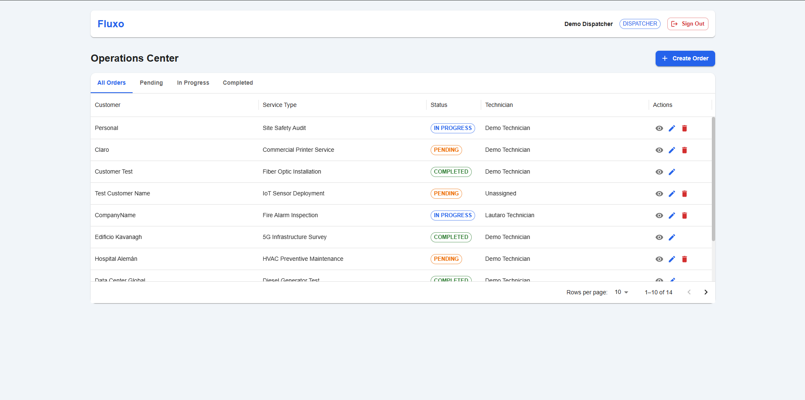
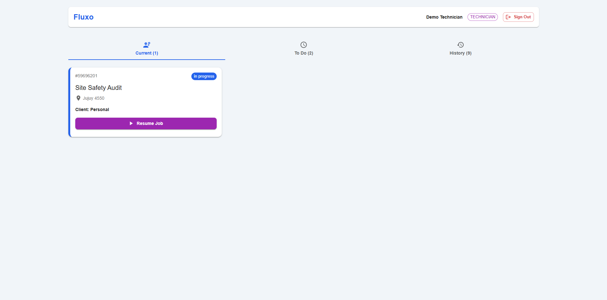

# ⚡ Fluxo | Intelligent Field Service Management

[](fluxo-tau.vercel.app)
[](https://github.com/lautarocristiani/fluxo)
[](LICENSE)

**Fluxo** is a modern **Field Service Management (FSM)** SaaS designed to streamline operations between back-office dispatchers and field technicians. It features dynamic form generation based on service types, role-based dashboards, and real-time state management.

<div align="center"> 
  
  
</div>

---

## 🚀 Live Demo & Credentials

Access the live application here:
👉 **[fluxo-tau.vercel.app](fluxo-tau.vercel.app)**

Use the **Quick Access** buttons on the login screen or these credentials:

| Role | Email | Password | Features |
| :--- | :--- | :--- | :--- |
| **Dispatcher** | `demo.admin@fluxo.com` | `fluxo123` | Create Orders, Assign Tasks, Global Dashboard |
| **Technician** | `demo.tech@fluxo.com` | `fluxo123` | Execute Orders, Dynamic Forms, Mobile View |

---

## 🛠️ Tech Stack

Built with a **Feature-Based Architecture** ensuring scalability and enterprise standards.

* **Core:**   
* **State & UI:**  
* **Forms:** `react-jsonschema-form` (RJSF) for Dynamic Workflows.
* **Backend:**  (PostgreSQL + RLS + Auth).

---

## ✨ Key Features

### 1. Role-Based Access Control (RBAC)
* **Dispatchers:** Access a comprehensive **Data Grid** to monitor operations, filter by status, and assign tasks.
* **Technicians:** Access a focused, **Mobile-First Card View** showing only their active assignments.
* **Security:** Enforced via Protected Routes (Frontend) and Row Level Security Policies (Database).

### 2. Dynamic Workflow Engine
Work orders are not static. Fluxo uses **JSON Schema** stored in PostgreSQL to generate specific forms for different job types (e.g., *Fiber Installation* vs. *HVAC Maintenance*) without changing frontend code.

### 3. Professional Authentication
* Custom Split-Screen Login/Register UI.
* Automatic Profile creation via Database Triggers.
* Metadata handling (Roles, Names) securely stored.

---

## 🗺️ Documentation & BDD

This project follows a Behavior-Driven Development approach.

* **[📂 BDD Scenarios](./docs/BDD_SCENARIOS.md):** The source of truth for testing and logic.
* **[👤 User Stories](./docs/USER_STORIES.md):** Detailed product definitions and acceptance criteria.

---

## 📂 Project Structure

```text
src/
├── features/           # Domain-driven features
│   ├── auth/           # Login, Register, Demo Logic
│   ├── dashboard/      # Role-specific views
│   └── work-orders/    # Order management logic
├── store/              # Global State (Zustand)
├── lib/                # Third-party config (Supabase)
├── routes/             # Navigation & Protected Routes
└── types/              # TypeScript Interfaces (DB generated)
```

---

## 🛠️ Local Setup

**1. Clone the repository**

```bash
git clone https://github.com/lautarocristiani/fluxo.git
cd fluxo
```

**2. Install dependencies**

```bash
npm install
```

**3. Configure Environment Variables**

```bash
VITE_SUPABASE_URL=your_project_url
VITE_SUPABASE_ANON_KEY=your_anon_key
```

**4. Database Setup**

Run the SQL script located in db/schema.sql in your Supabase SQL Editor to create tables, triggers, and seed data.

**5. Run the app**

```bash
npm run dev
```